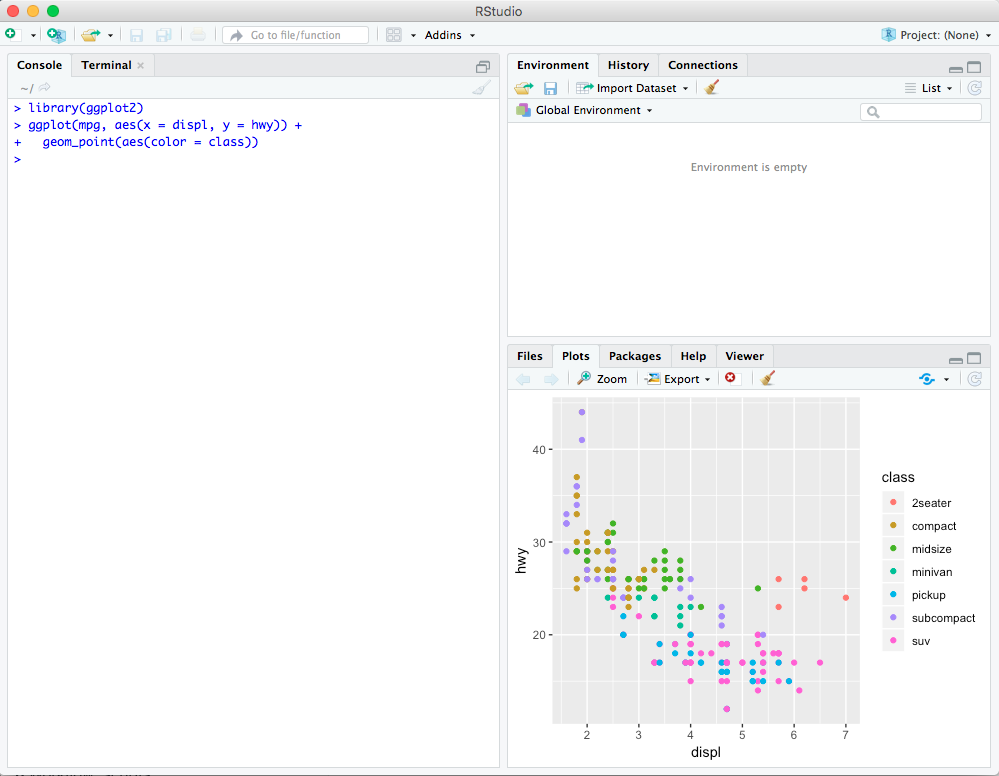

---

### Table of Contents
* Introduction 
    * [Coding environment](#codeEnv)
    * [Credit](#credit)
    * [Textbook](#Textbook)
* [Access to course material](#Access-course-material)
* Installations
    * [R](#install-R)
    * [RStudio](#install_RStudio)
    * [Install Libraries](#install_libraries)
* [Downloading course material](#Downloading-course-material)

---

# Introduction
Throughout this course we will be using *R for Data Science* book by Hadley Wickham and Garrett Grolemund. Many of the concept definitions, examples, and images in these notebook series are directly taken from Hadley's book, typically with some modifications. For a deeper understanding I recommend reading this book. (Check the **Textbook** section below)

A typical workflow in a data science project looks something like this:

<center> {width=600} </center>

We will touch on all of these modules separately in the upcoming notebooks and work with some of the most popular tools to answer questions about our data. You'll use these tools in every data science project, but for most projects they're not enough. There's a rough 80-20 rule at play; you can tackle about 80% of every project using the tools that you'll learn here, but you'll need other tools to tackle the remaining 20% which could vary based on the problem.

<a class="anchor" id="codeEnv"></a>

### Coding environment 
Typically, we use a secondary environment to write R code. There are various options but by far the most popular one is RStudio and that's what we will mainly use throughout this course. Some of the advantages of using an IDE such as RStudio is that we have access to all the environment variables, and can write, run, and debug an R script, look up the help documentation, and plot interactive charts all in one single window. 

I will present the material using R notebooks. Notebooks allow one to create and share documents that contain live code, equations, visualizations and narrative text. Later on this page you will learn how to run these notebooks, but the primary goal of this course is to learn programming with R and the powerful functionalities of RStudio.

<a class="anchor" id="credit"></a>

### Credit 
In these notebooks I have used a modified version of the content and several examples from [R for Data Science](https://www.amazon.com/Data-Science-Transform-Visualize-Model/dp/1491910399) by Hadley Wickham and Garrett Grolemund. This book is under the [Creative Commons Attribution-NonCommercial-NoDerivs 3.0](https://creativecommons.org/licenses/by-nc-nd/3.0/us/) License.

<a class="anchor" id="Textbook"></a>

### Textbook 
The primary textbook, **R for Data Science**, can be used for deeper explanation. You can access and download a free copy from [here](http://r4ds.had.co.nz/), or buy a paper copy from [Amazon](https://www.amazon.com/Data-Science-Transform-Visualize-Model/dp/1491910399).

<center> {width=300} </center>

...and yes that's a [kākāpō](https://www.youtube.com/watch?v=9T1vfsHYiKY). 

Additional materials:

* [An Introduction to Applied Multivariate Analysis with R](https://www.amazon.com/Introduction-Applied-Multivariate-Analysis-Use/dp/1441996494)
* [Hands-On Programming with R](https://rstudio-education.github.io/hopr/)
* [R Programming for Data Science](https://bookdown.org/rdpeng/rprogdatascience/)

--- 

<a class="anchor" id="Access-course-material"></a>

## Access to course material
You can access all the notebooks and relevant material from the [course GitHub](https://github.com/soltaniehha/Intro-to-Data-Analytics-in-R). Use to the following BitLink:

# bit.ly/BA780

---

<a class="anchor" id="install-R"></a>

# Installations

<left> {width=100} </left>

Download the latest version of R. Go to [CRAN](https://cran.r-project.org/mirrors.html), the comprehensive R archive network. Use the cloud mirror, https://cloud.r-project.org, which automatically will figure a mirror that's close to you. Follow the instructions for installation.

Every year a major version of is released, and typically a few minor versions. It's a good practice to periodically upgrade your R, especially when the major version becomes available.

<a class="anchor" id="install_RStudio"></a>

<left> {width=300} </left>

RStudio is a free and open-source integrated development environment, IDE, for R programming. Download the latest version of **RStudio Desktop** (free) from http://www.rstudio.com/download and install it.

RStudio is an easy-to-use coding environment that allows users to code, visualize, and debug all from one window (like most IDEs). In the image below you can see that code written in Console (left) results in a plot that gets outputted in the Plots section (lower right). We will get to know and interact with the other parts and modules of RStudio in the future notebooks.

<center> {width=600} </center>

You will also need to install some R packages. An R package is a collection of functions, data, and documentation that extends the capabilities of base R. Using the right packages is key to the successful use of R and equivalent to not reinventing the wheel. 

---

<a class="anchor" id="install_libraries"></a>

# Install Libraries

You can install new libraries (packages) in R by the `install.packages("PACKAGE_NAME")` command. If we want to install multiple packages at once we can use `install.packages(c("PACKAGE_1", "PACKAGE_2", "PACKAGE_3"))` format. To start this course install all the packages needed by

> `install.packages(c("tidyverse", "openxlsx"))`

## Tidyverse 

The majority of the packages that we will use throughout this bootcamp are part of the so-called *tidyverse* suite. [tidyverse](https://www.tidyverse.org/packages/) is a collection of R packages designed for data science.

Core packages in *tidyverse*:

* [ggplot2](http://ggplot2.tidyverse.org): for visualizing data
    * based on “A Layered Grammar of Graphics”
* [dplyr](https://dplyr.tidyverse.org/): for manipulating data
* [tidyr](http://tidyr.tidyverse.org/): for tidying data
* [readr](http://readr.tidyverse.org/): for reading data files
* [purrr](http://purrr.tidyverse.org/): for working with functions and vectors
* [tibble](http://tibble.tidyverse.org/): modern re-imagining of the data frame
* [stringr](http://stringr.tidyverse.org/): for working with strings
* [forcats](http://forcats.tidyverse.org/): for working with factors

You can install the complete tidyverse with a single line of code in the Console:

> ```install.packages("tidyverse")```


*The tidyverse also includes many other packages with more specialized usage. They are not loaded automatically and should be specified manually*

Once the installation is finished you can try the `library(tidyverse)` command in your RStudio Console to load the package. If the attachment was successful you would see the list of packages that were attached, and any potential conflicts, which you can ignore for now. If anything else from tidyverse is needed, they should be loaded manually. I.e. `library(PACKAGE_TO_LOAD)`.

We only need to install every new library once, but we need to load it every time we start a new R session.

## Other packages
* openxlsx: writing to an Excel file

> ```install.packages("openxlsx")```

* ggthemes: themes

> `install.packages("ggthemes")`

* nycflights13: sample data - NYC flights in 2013

> `install.packages("nycflights13")`

* plotly: interactive visualization

> `install.packages("plotly")`

* maps: plotting maps

> `install.packages("maps")`

### Install all packages at once:
`install.packages(c("tidyverse", "openxlsx", "ggthemes", "nycflights13", "plotly", "maps"))`

---

<a class="anchor" id="Downloading-course-material"></a>

## Downloading course material

You can download all the notebooks and relevant material from the [course GitHub](https://github.com/soltaniehha/Intro-to-Data-Analytics-in-R) (or **bit.ly/BA780**) by clicking on **Clone or download** button. 

Alternatively, you can use the following command in your computer's terminal to clone. You need to have Git installed in order for it to work

> `git clone https://github.com/soltaniehha/Intro-to-Data-Analytics-in-R.git`

Both these methods work, the one I would recommend is to clone this repository from your RStudio. You can follow these steps:

1. In RStudio select Project on the top right corner and then New Project
2. Select Version Control and then Git
3. In the Repository URL paste `https://github.com/soltaniehha/Intro-to-Data-Analytics-in-R.git` and call its name Intro-to-Data-Analytics-in-R (or any name of your choice)
4. Select the location you would like this repository to be stored and then click Create Project
5. Now every time the project (repo) gets updated you can go to the Git tab and "Pull" the latest version.