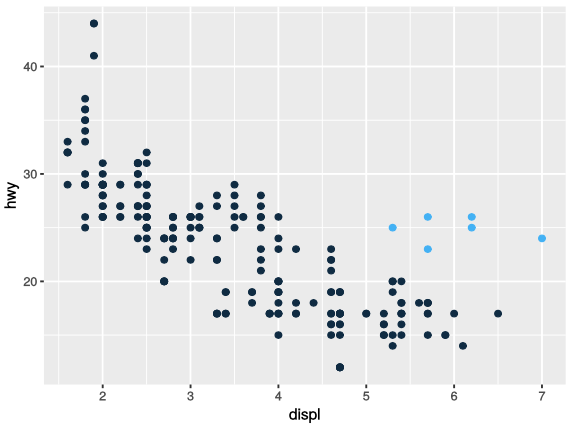

Now that we have a general idea of all the seven layers of ggplot2 let's take a deeper dive into them. We will start with aesthetics.

Looking back at the first graph we made, we see that there are a few car models that despite their engine size are relatively efficient (~25 mpg) and seem to fall out of the linear trend (blue circles). How can we explain these cars? 

<center> {width=500} </center>

We might be able to explain it by their class attribute, after all not all large engine vehicles are SUV. Let's use `class` column to color the points. To do this we need to map this field to an **aesthetic**. An aesthetic is a visual property of the objects in our plot. Aesthetics include things like size, shape, or the color of our points.

Fun fact: If you prefer British English, like Hadley, you can use `colour` instead of `color`.

First let's load the packages:

```{r}
# loading libraries
library(tidyverse)

# modifying chart size
options(repr.plot.width=5, repr.plot.height=3)
```
Now we will color the points using their classes:
```{r}
ggplot(data = mpg) + 
  geom_point(mapping = aes(x = displ, y = hwy, color = class))
```

The colors reveal that many of the unusual points are two-seater cars. These sports cars have large engines like SUVs and pickup trucks, but small bodies like midsize and compact cars, which improves their gas mileage.

This is great that ggplot will automatically pick up colors for us, but we can also set the scale color:

```{r}
# Change range of hues used
ggplot(data = mpg) + 
  geom_point(mapping = aes(x = displ, y = hwy, color = class)) +
  scale_color_hue(h = c(0, 100))
```

Or we could set them manually using hex color codes:

```{r}
# Set manually 
ggplot(data = mpg) + 
  geom_point(mapping = aes(x = displ, y = hwy, color = class)) +
  scale_color_manual(values = c("#f44242", "#f47741", "#f4c441", "#dff441", "#82f441", "#41f4e8", "#419af4"))
```

There are many webpages and tools that provide the hex code related to the color you are interested in. Simply Google "hex color" to get an easy-to-use tool. 

You can also set the aesthetic properties of all points together. For example, we can make all of the points in our plot blue:

```{r}
ggplot(data = mpg) + 
  geom_point(mapping = aes(x = displ, y = hwy), color = "blue")
```

```{r}
ggplot(data = mpg) + 
  geom_point(mapping = aes(x = displ, y = hwy), color = "#f44242") # hex coloring
```

### Coloring for Colorblindness

About 1 in 20 people are colorblind in some way. This means that one or more of the types of cone cells in their eyes — the cells we use to detect color — does not work normally. Because of this, a person who is colorblind sees a reduced color space; two colors which appear distinct to a person with normal color vision may appear to be the same to a person who is colorblind. This phenomenon is not random. Mathematically, there are lines through color space — called "confusion lines" — such that every color on a confusion line appears the same to a person who is colorblind as every other color on that same confusion line.

This webpage by David Nichols has a brief but friednly explanaition of colorblindness and ways to make your charts more accessible to most people: https://davidmathlogic.com/colorblind