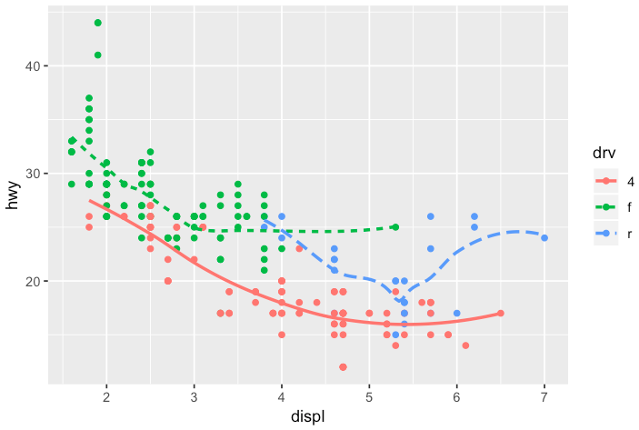

### Exercise 1
What does `na.rm = FALSE` in `geom_point()` do?

----

### Exercise 2
What does `show.legend = FALSE` do? Show with an example

----

### Exercise 3
Will these two graphs look different? Why/why not?

> `ggplot(data = mpg, mapping = aes(x = displ, y = hwy)) +`  
  `  geom_point() +`  
  `  geom_smooth()`  
  
> `ggplot() + `  
  `geom_point(data = mpg, mapping = aes(x = displ, y = hwy)) + `  
  `geom_smooth(data = mpg, mapping = aes(x = displ, y = hwy))`

----

### Exercise 4
Recreate the R code necessary to generate the following graphs:

