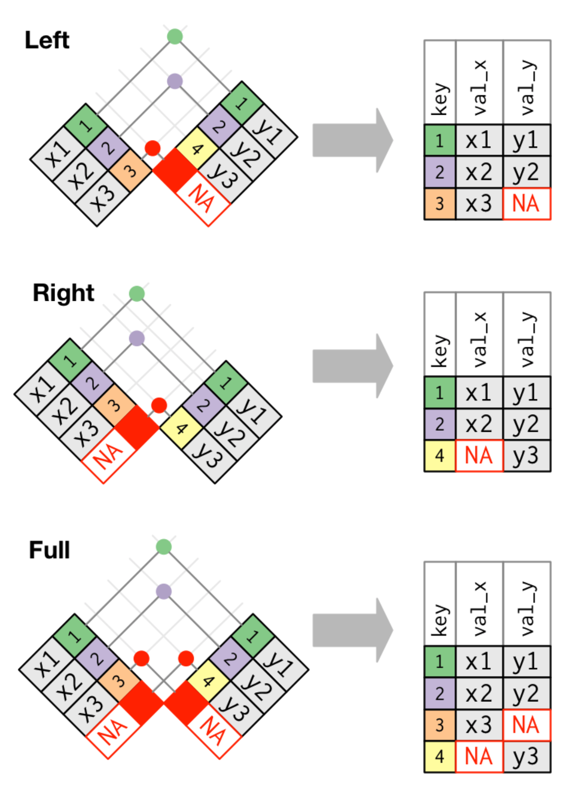
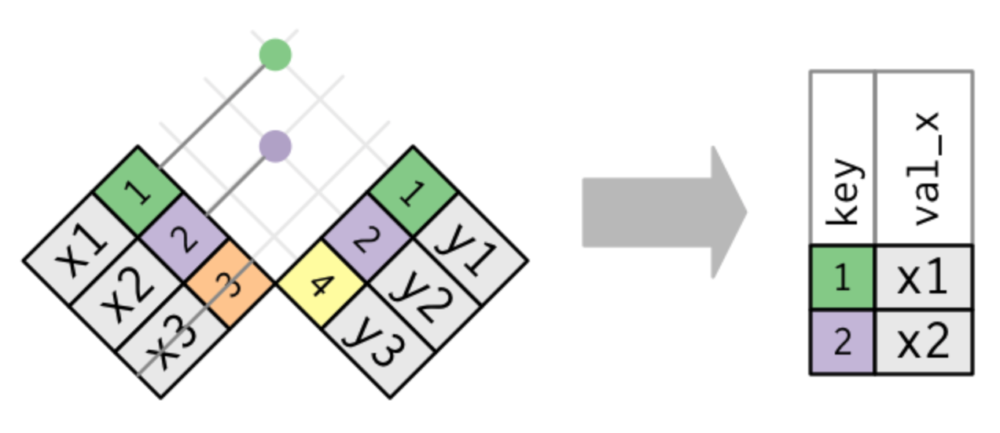

```{r include=FALSE}
# loading libraries
library(tidyverse)
library(nycflights13)

# modifying chart size
options(repr.plot.width=5, repr.plot.height=3)
```


### Table of Contents
* Relational Data with dplyr
    * Keys
    * Mutating Joins
        * Inner join
        * Outer joins
    * Filtering joins
    * Join problems
    * Set operations

## Relational Data with dplyr
Typically we will be using more than one table of data for an analysis. Multiple tables of data that relate to each other are called relational data. 

Most common place to find relational data is relational databases. If you have used SQL for accessing a database, you will find most of the concepts and operations defined here very similar.

To work with relational data you need verbs (functions) that work with pairs of tables. There are three families of verbs designed to work with relational data:

* **Mutating joins**, which add new variables to one dataframe from matching observations in another.
* **Filtering joins**, which filter observations from one dataframe based on whether or not they match an observation in the other table.
* **Set operations**, which treat observations as if they were set elements.

**dplyr** provides a variety of two-table verbs that we will introduce them here. But first let's look at the tables that we will be using here.

#### nycflights13 package
We will use the nycflights13 package to learn about relational data. nycflights13 contains four dataframes that are related to the `flights`, the dataframe that we used previously.

The drawing below shows how this relationship is defined:


```{r}
airlines
```

```{r}
airports
```

```{r}
planes
```

```{r}
weather
```

For nycflights13:

* `flights` connects to `planes` via a single variable, `tailnum`.
* `flights` connects to `airlines` through the `carrier` variable.
* `flights` connects to `airports` in two ways: via the `origin` and `dest` variables.
* `flights` connects to `weather` via `origin` (the location), `year`, `month`, `day` and `hour` (the time).


---

### Keys
A key is a variable (or set of variables) that uniquely identifies an observation. In simple cases, a single variable is sufficient to identify an observation. For example, each plane is uniquely identified by its `tailnum`. In other cases, multiple variables may be needed. For example, to identify an observation in weather you need five variables: `year`, `month`, `day`, `hour`, and `origin`.

There are two types of keys:

* A **primary key** uniquely identifies an observation in its own table. For example, `planes$tailnum` is a primary key because it uniquely identifies each plane in the planes table.
* A **foreign key** uniquely identifies an observation in another table. For example, the `flights$tailnum` is a foreign key because it appears in the flights table where it matches each flight to a unique plane.

A variable can be both a primary key and a foreign key. For example, `origin` is part of the `weather` primary key, and is also a foreign key for the `airport` table.

Once you've identified the primary keys in your tables, it's a good practice to verify that they do indeed uniquely identify each observation. One way to do that is to `count()` the primary keys and look for entries where n is greater than one:

```{r}
planes %>% 
  count(tailnum) %>% 
  filter(n > 1)
```

Sometimes a table doesn't have an explicit primary key: each row is an observation, but no combination of variables reliably identifies it. For example:

```{r}
weather %>% 
  count(year, month, day, hour, origin) %>% 
  filter(n > 1)
```

what's the primary key in the flights table? You might think it would be the date plus the flight or tail number, but neither of those are unique:

```{r}
flights %>% 
  count(year, month, day, flight) %>% 
  filter(n > 1)
```

```{r}
flights %>% 
  count(year, month, day, tailnum) %>% 
  filter(n > 1)
```

Each flight number can be used more than once a day. With the existing data in `flights` table we can see the following combination could be the key:

`year, month, day, flight, origin, dest, tailnum`

```{r}
flights %>% 
  count(year, month, day, flight, origin, dest, tailnum) %>% 
  filter(n > 1)
```

We should be cautious when defining the primary key (PK) for a table. It could be that for the existing data a combination of variables would work as a PK but it won't stand unique for the future data. If a table lacks a primary key, it's sometimes useful to add one with `mutate()` and `row_number()`.

```{r}
flights %>%
  arrange(year, month, day, origin, dest, flight, tailnum) %>%
  mutate(row_n = row_number()) %>%
  select(row_n, everything())
```

That makes it easier to match observations if you've done some filtering and want to check back in with the original data.

A primary key and the corresponding foreign key in another table form a relation.

---

### Mutating Joins
Joins are used to combine a pair of tables. These are known as mutating joins because we will be adding new variables from another table. This is possible through the foreign key. For instance, we can combine `flights` dataframe with `airlines` to get the full names of 2-letter `carrier` by using a **left join**:

```{r}
flights %>%
  left_join(airlines, by = "carrier") %>%
  select(carrier, name, everything())
```

We are going to use a visual representation to illustrate different types of joins. Consider these 2 dataframes: `x` and `y`


```{r}
x <- tribble(
  ~key, ~val_x,
     1, "x1",
     2, "x2",
     3, "x3"
)
x
```

```{r}
y <- tribble(
  ~key, ~val_y,
     1, "y1",
     2, "y2",
     4, "y3"
)
y
```

First column with colored numerical values is the key for both tibbles and is used to find the matching records across the tables.

A join is a way of connecting each row in x to zero, one, or more rows in y. The following diagram shows each potential match as an intersection of a pair of lines. For illustration purposes we have switched the order of `key` and `val_x` in `x`:


In an actual join, matches will be indicated with dots. The number of dots = the number of matches = the number of rows in the output.


---

### Inner join
The simplest type of join is the inner join. An inner join matches pairs of observations whenever their keys are equal:


We use `by` parameter to tell dplyr which variable is the key:

```{r}
inner_join(x, y, by = "key")
```

Note that unmatched rows are not included in the result. This means that inner joins are usually not appropriate for use in analysis because it's too easy to lose observations.

---

## Outer joins
An outer join keeps observations that appear in at least one of the tables. There are three types of outer joins:

* A **left join** keeps all observations in the left dataframe, `x`.
* A **right join** keeps all observations in in the right dataframe, `y`.
* A **full join** keeps all observations in both dataframes, `x` and `y`.



The most commonly used join is the left join: you use this whenever you look up additional data from another table, because it preserves the original observations even when there isn't a match. The left join should be your default join: use it unless you have a strong reason to prefer one of the others.

Another way to visually represent these joins:


```{r}
# Left join
x %>% 
  left_join(y, by = "key")
```

```{r}
# Right join
x %>% 
  right_join(y, by = "key")
```

```{r}
# Full join
x %>% 
  full_join(y, by = "key")
```

SQL is the inspiration for dplyr's conventions, so the translation is straightforward:

| dplyr                      | SQL                                          |
| :------------------------- | :------------------------------------------- |
| inner_join(x, y, by = "z") | SELECT * FROM x INNER JOIN y USING (z)       |
| left_join(x, y, by = "z")  | SELECT * FROM x LEFT OUTER JOIN y USING (z)  |
| right_join(x, y, by = "z") | SELECT * FROM x RIGHT OUTER JOIN y USING (z) |
| full_join(x, y, by = "z")  | SELECT * FROM x FULL OUTER JOIN y USING (z)  |	

Base R also provides join functionality by `merge()` function, but using dplyr joining is much faster, more consistent and unlike `merge()` dplyr doesn't change the order of the rows after the join.

**Handling duplicate keys:**

```{r}
a <- tribble(
  ~key, ~val_x,
     1, "x1",
     2, "x2",
     2, "x3",
     3, "x4"
)
b <- tribble(
  ~key, ~val_y,
     1, "y1",
     2, "y2",
     2, "y3",
     3, "y4"
)
left_join(a, b, by = "key")
```

#### Defining the key columns
The default, `by = NULL`, uses all variables that appear in both tables, the so called natural join. For example, the `flights` and `weather` tables match on their common variables: `year`, `month`, `day`, `hour` and `origin`:

```{r}
flights %>% 
  left_join(weather)
```

We can also specify what key to use:

```{r}
flights %>% 
  left_join(planes, by = "tailnum")
```

`by = c("a" = "b")`. This will match variable `a` in table `x` to variable `b` in table `y`. The variables from `x` will be used in the output:

```{r}
flights %>% 
  left_join(airports, by = c("dest" = "faa"))
```

---

### Filtering Joins 
Filtering joins match observations in the same way as mutating joins, but affect the observations, not the variables. There are two types:

* `semi_join(x, y)` **keeps** all observations in `x` that have a match in `y`.
* `anti_join(x, y)` **drops** all observations in `x` that have a match in `y`.

Semi-joins are useful for matching filtered summary tables back to the original rows. For example:

```{r}
# Top 10 most favorite destinations
flights %>%
  count(dest, sort = TRUE) %>% 
  head(10) -> top_dest
```

The following gives all the flight records to the top 10 destinations:

```{r}
flights %>% 
  semi_join(top_dest, by = "dest")
```

Graphically, a semi-join looks like this:



Only the existence of a match is important; it doesn't matter which observation is matched. This means that filtering joins never duplicate rows like mutating joins do.

The inverse of a semi-join is an anti-join. An anti-join keeps the rows that don't have a match:


Anti-joins are useful for diagnosing join mismatches. For example, when connecting flights and planes, you might be interested to know that there are many flights that don't have a match in `planes`:

```{r}
flights %>%
  anti_join(planes, by = "tailnum") %>%
  count(tailnum, sort = TRUE)
```

---

### Join problems
We have been working with clean data, this is often not the case in real world. Have the following points in mind when joining dataframes to avoid making mistakes:

1. Start by identifying the variables that form the primary key in each table. You should usually do this based on your understanding of the data, not empirically by looking for a combination of variables that give a unique identifier. If you just look for variables without thinking about what they mean, you might get (un)lucky and find a combination that's unique in your current data but the relationship might not be true in general.
    * For example, the altitude and longitude uniquely identify each airport, but they are not good identifiers!


2. Check that none of the variables in the primary key are missing. If a value is missing then it can't identify an observation!


3. Check that your foreign keys match primary keys in another table. The best way to do this is with an `anti_join()`. It's common for keys not to match because of data entry errors. Fixing these is often a lot of work.


4. Be aware that simply checking the number of rows before and after the join is not sufficient to ensure that your join has gone smoothly. If you have an inner join with duplicate keys in both tables, you might get unlucky as the number of dropped rows might exactly equal the number of duplicated rows!

---

### Set operations
All these operations work with a complete row, comparing the values of every variable. These expect the `x` and `y` inputs to have the same variables, and treat the observations like sets:

* `intersect(x, y)`: return only observations in both `x` and `y`.
* `union(x, y)`: return unique observations in `x` and `y`.
* `setdiff(x, y)`: return observations in `x`, but not in `y`.

Given this simple data:

```{r}
df1 <- tribble(
  ~x, ~y,
   1,  1,
   2,  1
)
df2 <- tribble(
  ~x, ~y,
   1,  1,
   1,  2
)
```

The four possibilities are:

```{r}
intersect(df1, df2)
```

```{r}
union(df1, df2)
```

note that union automatically filters the overlapping records, hence 3 rows!

```{r}
setdiff(df1, df2)
```

```{r}
setdiff(df2, df1)
```
